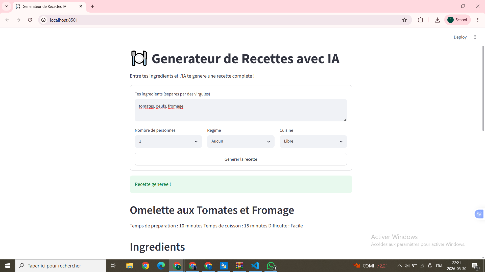
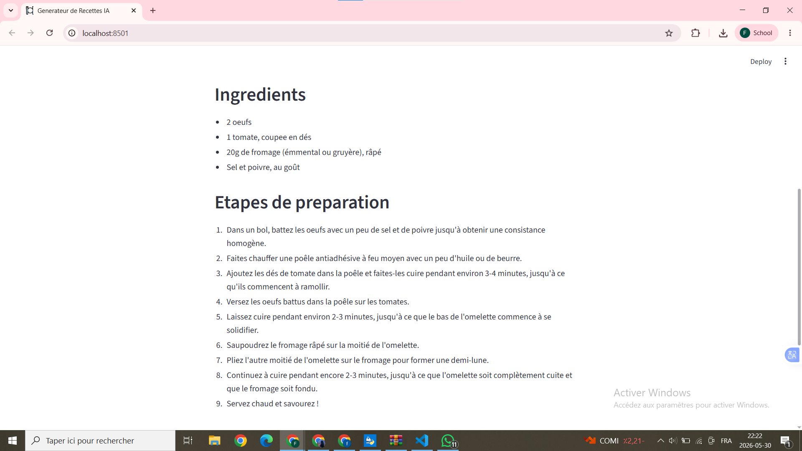
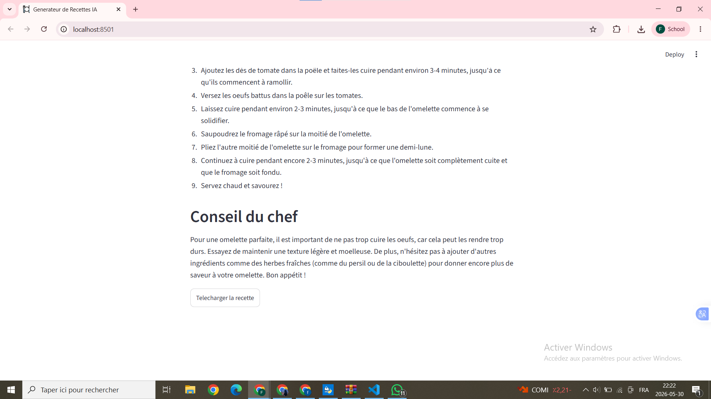

# Générateur de Recettes avec IA

Application web qui génère des recettes personnalisées à partir d'ingrédients,
en utilisant le modèle LLM Llama 3 via Groq API.

## Fonctionnalités
- Génération de recettes à partir d'ingrédients
- Choix du régime alimentaire (Végétarien, Vegan, Sans gluten)
- Choix du type de cuisine (Française, Italienne, Asiatique, Maghrébine)
- Choix du nombre de personnes
- Téléchargement de la recette en .txt

## Technologies utilisées
- Python 3.12
- Streamlit (interface web)
- Groq API + Llama 3.3 70b (modèle LLM génératif)

## Comment lancer le projet

1. Installer les dépendances :
pip install streamlit groq

2. Lancer l'application :
streamlit run app.py

## Démo en ligne
[Cliquez ici pour accéder à l'application](demo.mp4)

## Captures d'écran

## Étudiante
- Fatma Ghribi 2DAD